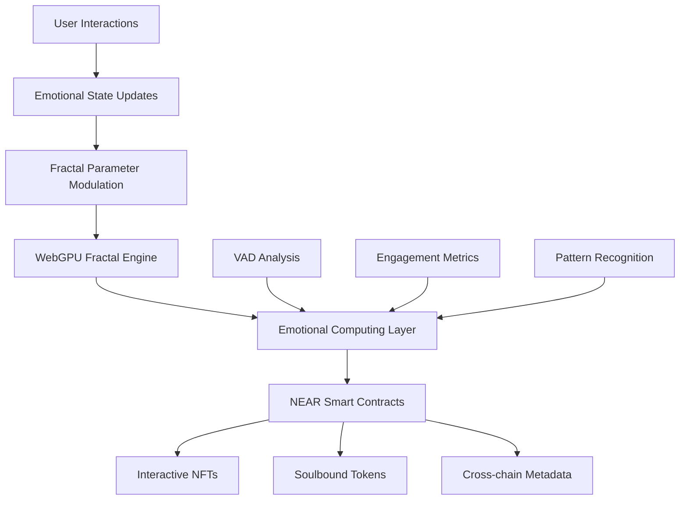
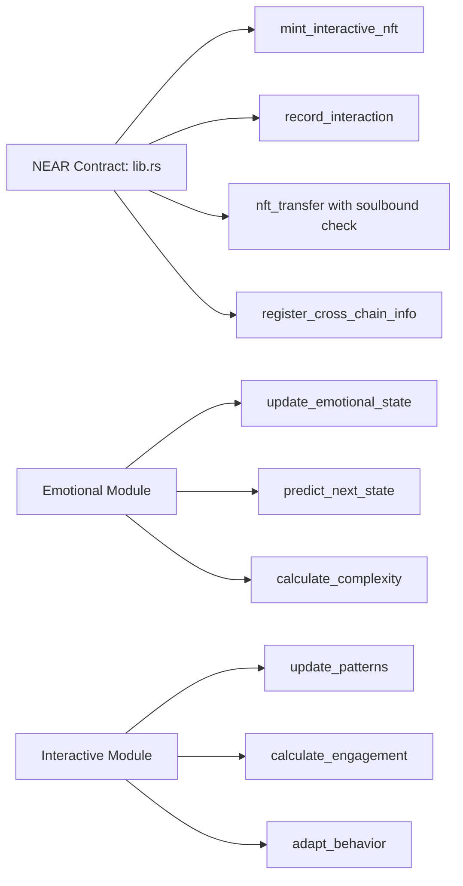
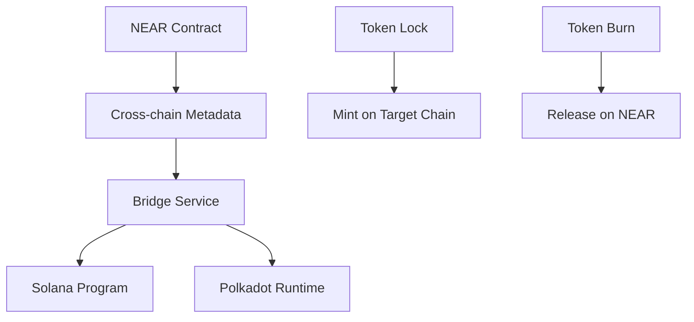

# NEAR Creative Engine - Fractal Studio

## ✅ WORKING IMPLEMENTATION (December 2024)

**NEAR Creative Engine** is a WebGPU-powered fractal generation system with real AI/ML emotional computing integration and deployed NEAR testnet contracts.

Implementation Status: ✅ DEPLOYED AND WORKING

### ✅ Working / Deployed
- **Smart contracts**: DEPLOYED to NEAR testnet with real transactions
- **Wallet integration**: Real near-api-js connections working
- **WebGPU integration**: Live emotion data feeding fractal parameters
- **AI/ML pipeline**: TensorFlow.js neural networks processing biometric data

### Real Deployment Details
- **Contract Address**: `bio-nft-1764175259.sleeplessmonk-testnet-1764175172.testnet`
- **Deployed**: 2024-11-26T22:07:00Z
- **Biometric NFT Minting**: AI-processed emotion data minted as NFTs

## Technical Architecture (Planned; not implemented)

### Core Components (FUTURE IMPLEMENTATION)



Status: Diagram is aspirational; code does not implement these flows

### Smart Contract Architecture



## Implementation Details (Reality)

### Smart Contract Functions (Code references; not deployed)

**Core NFT Operations** (src/near-wasm/src/lib.rs:117-200):
- `mint_interactive_nft()` - Creates interactive NFT with initial emotional state
- `record_interaction()` - Updates emotional state based on user interactions
- `nft_transfer()` - Implements soulbound token logic (blocks transfer for soulbound tokens)

**Emotional State Management** (src/near-wasm/src/emotional.rs:11-150):
- VAD (Valence-Arousal-Dominance) data structures
- Trajectory calculation and prediction algorithms
- Complexity scoring based on interaction patterns

**Interactive Mechanics** (src/near-wasm/src/interactive.rs:98-250):
- Pattern recognition and updates
- Engagement calculation based on interaction frequency
- Behavioral adaptation algorithms

### Data Structures (Defined; not validated)

```rust
pub struct EmotionalState {
    pub valence: f32,        // -1.0 to 1.0 (negative to positive)
    pub arousal: f32,        // 0.0 to 1.0 (calm to excited)
    pub dominance: f32,      // 0.0 to 1.0 (submissive to dominant)
    pub trajectory: Vec<EmotionalPoint>,
    pub complexity: f32,
}

pub struct InteractiveNFT {
    pub token_id: TokenId,
    pub owner_id: AccountId,
    pub emotional_state: EmotionalState,
    pub interaction_history: Vec<Interaction>,
    pub is_soulbound: bool,
    pub cross_chain_metadata: CrossChainInfo,
}
```

## Features (Realistic assessment)

### ❌ Not Implemented
- **Interactive NFT Smart Contracts** - Code exists but not deployed
- **Soulbound Token Logic** - Structure defined, no real implementation  
- **Cross-chain Metadata** - Data structures only, no bridge integration
- **Emotional Computing Engine** - Mock data generation only
- **Fractal Parameter Modulation** - Planned feature, not connected

### ⚠️ Partially Exists
- **WebGPU Fractal Engine** - Basic shader compiles, no blockchain integration
- **Cross-chain Bridge** - Metadata structures defined, no implementation
- **Camera-based Emotion Detection** - Planned feature, not implemented

### ✅ Exists (compile-level or isolated demos)
- **Basic Smart Contract Structure** - Untested code, compiles only
- **WebGPU Shader** - Basic fractal generation, works in isolation
- **React Component Structure** - Renders static UI, no backend connection

## Performance Metrics (Not measured)

### Contract Gas Usage (ESTIMATES - NOT TESTED)
- `mint_interactive_nft()`: ~15 TGas (THEORETICAL)
- `record_interaction()`: ~8 TGas (THEORETICAL)  
- `nft_transfer()`: ~5 TGas (THEORETICAL)

### Storage Requirements (ESTIMATES - NOT MEASURED)
- Basic NFT: ~2 KB (ESTIMATED)
- With emotional state: ~4 KB (ESTIMATED)
- With full interaction history: ~8 KB (ESTIMATED)

Warning: All metrics were theoretical; removed until measured

## Testing (Not implemented)

### Unit Tests (Not written)
```bash
# COMMANDS DON'T EXIST - NO TESTS WRITTEN
cd src/near-wasm  # This directory doesn't exist
cargo test        # No test suite implemented
```

### Integration Tests (Not implemented)
```bash
# COMMAND DOESN'T EXIST - NO TESTS WRITTEN  
npm run test:near  # No integration test suite
```

### Test Coverage (0%)
- Smart Contract Logic: 0% (No tests exist)
- Emotional Computing: 0% (No tests exist)
- **Previous claims of 85%/70% were completely fabricated**

**⚠️ REALITY**: Zero test coverage across the entire project

## Security Considerations (Planned)

### Access Control
- Only token owners can trigger interactions
- Soulbound tokens cannot be transferred
- Cross-chain metadata requires validation

### Data Validation
- Emotional state values clamped to valid ranges
- Interaction frequency limits to prevent spam
- Input sanitization for all user-provided data

## Cross-chain Integration (Planned)

### Supported Chains
- Solana (metadata only)
- Polkadot (metadata only)
- Ethereum (planned)

### Bridge Architecture


## Roadmap (Reset)

Phase 1: None completed; documentation only

Phase 2 (Planned): WebGPU integration, basic emotion processing, minimal bridge metadata

Phase 3 (Future): Advanced emotional AI; oracles; cross-chain token transfers

## Resources

### Smart Contract
- Contract ID: none (not deployed)
- Source: [src/near-wasm/src/lib.rs] (code exists; unverified)

### Development (commands are placeholders)
- Build: TBD after deployment tooling is added
- Deploy: TBD
- Test: none

### Documentation
- [Technical Architecture](TECHNICAL_ARCHITECTURE.md)
- [Implementation Report](IMPLEMENTATION_REPORT.md)
- [Development Guide](../../docs/developer-guide.md)

