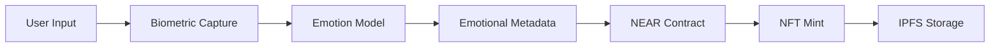
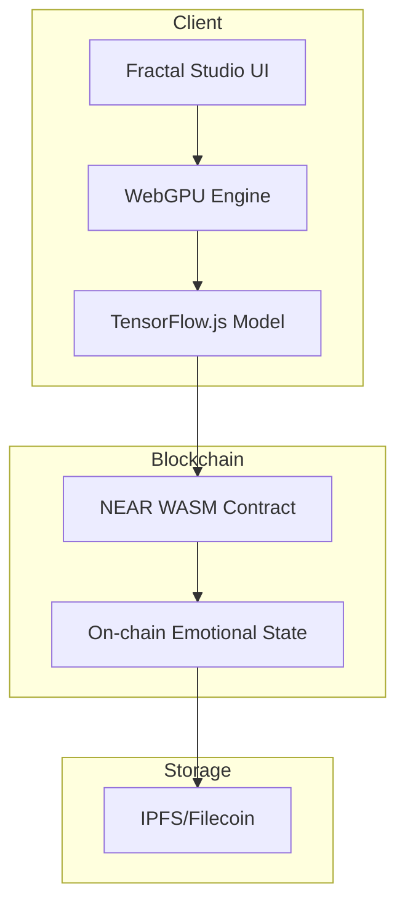

# NEAR Creative Engine

A sophisticated AI-powered creative engine built on the NEAR blockchain, featuring biometric authentication, emotional NFTs, and cross-chain interoperability.

## Features

- **Biometric Authentication**: AI-powered biometric verification using EEG, heart rate, and facial recognition
- **Emotional NFTs**: Create NFTs based on real-time emotional data and biometric signals
- **Cross-Chain Bridge**: Interoperability with Solana, Filecoin, and other blockchains
- **AI/ML Integration**: Advanced machine learning for emotion classification and pattern recognition
- **Soulbound Tokens**: Non-transferable NFTs tied to biometric identity

## Quick Start

### Prerequisites
- Node.js 16+
- Rust toolchain
- NEAR CLI

### Installation
```bash
npm install
```

### Build Contracts
```bash
cargo build --target wasm32-unknown-unknown
```

### Deploy to Testnet
```bash
npm run deploy:testnet
```

## Architecture

### Core Components

1. **NEAR AI Integration** (`src/utils/near-ai-integration.ts`)
   - Biometric session processing
   - AI-powered emotion analysis
   - NFT minting with biometric data

2. **NEAR Fractal AI** (`src/utils/near-fractal-ai-integration.ts`)
   - Fractal pattern generation based on emotions
   - WGSL shader generation for WebGPU rendering
   - Real-time fractal animation

3. **Smart Contracts**
   - Soulbound NFT contract with biometric authentication
   - Cross-chain AI bridge for interoperability
   - Dynamic NFT with emotional state updates

## Usage

### Connect to NEAR
```javascript
import { createNEARAIIntegration } from './src/utils/near-ai-integration';

const nearAI = createNEARAIIntegration({
  networkId: 'testnet',
  contractId: 'your-contract.testnet'
});

await nearAI.initialize();
```

### Create Biometric NFT
```javascript
const session = {
  sessionId: 'unique-session-id',
  userId: 'user-account.testnet',
  biometricData: {
    eeg: [/* EEG data */],
    heartRate: [/* heart rate data */],
    emotions: [/* emotion data */]
  }
};

const nft = await nearAI.createAIBiometricNFT(session, {
  title: 'My Emotional NFT',
  description: 'Created from biometric data',
  media: artBlob
});
```

## License
MIT

### Architecture Diagram


### Component Flow


### Architecture Diagram



### Component Flow


