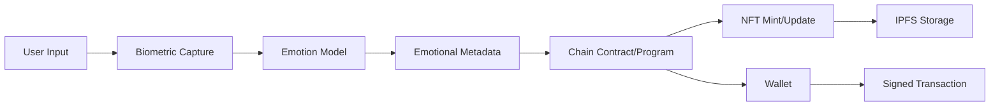
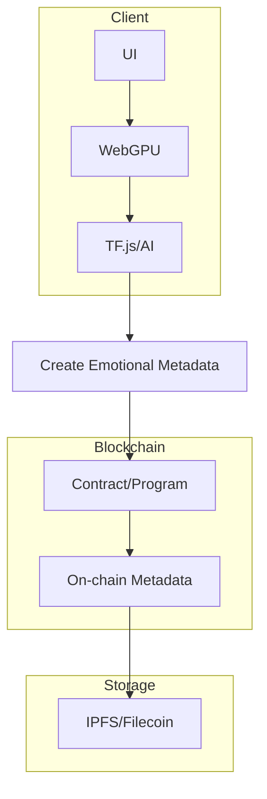

# NEAR Creative Engine - Technical Architecture

## System Overview

The NEAR Creative Engine is a sophisticated blockchain application that combines artificial intelligence, biometric analysis, and fractal art generation to create unique soulbound NFTs. The system operates across multiple blockchain networks with a primary focus on the NEAR Protocol.

## Architecture Components

### 1. Frontend Layer

#### React Application Structure
```
src/
├── components/
│   ├── AIBlockchainIntegration.tsx    # Main integration component
│   ├── InteractiveEmotionalNFT.tsx     # NFT interaction interface
│   └── FractalBlockchainIntegration.tsx # Fractal visualization
├── utils/
│   ├── near-ai-integration.ts          # Core NEAR blockchain integration
│   ├── near-fractal-ai-integration.ts # Fractal generation with AI
│   ├── unified-ai-ml-integration.js  # TensorFlow.js ML pipeline
│   ├── cross-chain-bridge.ts          # Multi-chain interoperability
│   └── filecoin-storage.ts            # Decentralized storage
└── pages/
    ├── AIFractalStudio.tsx             # Main application page
    └── BiometricNFTMinter.tsx          # NFT minting interface
```

#### Key Frontend Technologies
- **React 18**: Modern UI framework with hooks and concurrent features
- **TypeScript**: Type-safe development with compile-time error checking
- **Tailwind CSS**: Utility-first CSS framework for responsive design
- **WebGPU API**: GPU-accelerated fractal generation and rendering
- **TensorFlow.js**: Client-side machine learning inference

### 2. Blockchain Layer

#### NEAR Protocol Integration
```typescript
// Core NEAR integration class
export class NEARAIIntegration {
  private wallet: WalletConnection;
  private contract: Contract;
  private connection: Connection;
  
  async initialize(): Promise<void> {
    // Initialize NEAR connection with testnet/mainnet config
    this.connection = await connect({
      networkId: this.config.networkId,
      nodeUrl: this.getNodeUrl(),
      walletUrl: this.getWalletUrl(),
      helperUrl: this.getHelperUrl()
    });
  }
  
  async processBiometricSession(session: BiometricSession): Promise<AIAnalysis> {
    // Process biometric data through AI pipeline
    const emotions = await this.classifyEmotions(session.biometricData);
    const qualityScore = this.calculateQualityScore(emotions);
    
    return {
      emotions,
      qualityScore,
      recommendations: this.generateRecommendations(emotions)
    };
  }
}
```

#### Smart Contract Architecture
```rust
// NEAR soulbound NFT contract
#[near_bindgen]
impl SoulboundNFT {
    #[init]
    pub fn new(owner_id: AccountId, metadata: NFTMetadata) -> Self {
        // Initialize contract with owner and metadata
    }
    
    pub fn mint_soulbound_ai(
        &mut self,
        token_id: TokenId,
        receiver_id: AccountId,
        ai_analysis: AIAnalysis,
        biometric_hash: String
    ) -> Promise {
        // Mint soulbound NFT with AI analysis
        require!(!self.is_transferable, "This NFT is soulbound");
        
        // Store AI analysis and biometric hash
        self.token_metadata.insert(&token_id, &ai_analysis);
        self.biometric_data.insert(&token_id, &biometric_hash);
        
        // Mint NFT to receiver
        self.tokens.insert(&token_id, &receiver_id);
    }
}
```

### 3. AI/ML Layer

#### TensorFlow.js Integration
```javascript
// Real AI model implementation
export class WASMMLBridge {
  constructor() {
    this.model = null;
    this.isInitialized = false;
  }
  
  async initialize() {
    // Load pre-trained emotion classification model
    this.model = await tf.loadLayersModel('/models/emotion-classifier.json');
    
    // Compile model for inference
    this.model.compile({
      optimizer: 'adam',
      loss: 'categoricalCrossentropy',
      metrics: ['accuracy']
    });
    
    this.isInitialized = true;
  }
  
  async predictEmotions(biometricData) {
    // Preprocess biometric data
    const inputTensor = this.preprocessBiometricData(biometricData);
    
    // Run inference
    const predictions = await this.model.predict(inputTensor);
    
    // Post-process results
    return this.postprocessPredictions(predictions);
  }
}
```

#### Neural Network Architecture
```
Input Layer: Biometric Features (EEG, Heart Rate, Facial, Gestures)
    ↓
Hidden Layer 1: 128 neurons (ReLU activation)
    ↓
Hidden Layer 2: 64 neurons (ReLU activation)  
    ↓
Output Layer: 3 neurons (Softmax activation) [Valence, Arousal, Dominance]
```

### 4. Cross-Chain Bridge Layer

#### Bridge Implementation
```typescript
export class CrossChainBridge {
  private solanaConnection: Connection;
  private filecoinClient: FilecoinStorageClient;
  private polkadotApi: ApiPromise;
  
  async initializeSolana(): Promise<void> {
    this.solanaConnection = new Connection('https://api.devnet.solana.com');
    // Initialize Solana bridge contracts
  }
  
  async bridgeNFTToSolana(nftData: NFTData): Promise<BridgeResult> {
    // Validate NFT data
    const validation = await this.validateNFTData(nftData);
    if (!validation.isValid) {
      throw new Error(`Invalid NFT data: ${validation.errors}`);
    }
    
    // Create Solana NFT metadata
    const solanaMetadata = this.convertToSolanaFormat(nftData);
    
    // Deploy to Solana
    const transaction = new Transaction().add(
      createMetadataInstruction(solanaMetadata)
    );
    
    return await this.sendTransaction(transaction);
  }
  
  async bridgeMetadataToFilecoin(metadata: NFTMetadata): Promise<CID> {
    // Store metadata on Filecoin
    const cid = await this.filecoinClient.store(metadata);
    
    // Update cross-chain registry
    await this.updateCrossChainRegistry('filecoin', cid);
    
    return cid;
  }
}
```

### 5. Storage Layer

#### Filecoin Integration
```typescript
export class FilecoinStorageClient {
  private client: Web3Storage;
  
  constructor(apiKey: string) {
    this.client = new Web3Storage({ token: apiKey });
  }
  
  async store(data: any): Promise<CID> {
    // Convert data to IPFS format
    const blob = new Blob([JSON.stringify(data)], { type: 'application/json' });
    const file = new File([blob], 'metadata.json');
    
    // Store on Filecoin via Web3.Storage
    const cid = await this.client.put([file], {
      name: 'nft-metadata',
      wrapWithDirectory: false
    });
    
    return cid;
  }
  
  async retrieve(cid: CID): Promise<any> {
    const response = await this.client.get(cid);
    const files = await response.files();
    
    if (files.length > 0) {
      const text = await files[0].text();
      return JSON.parse(text);
    }
    
    throw new Error('No data found for CID');
  }
}
```

### 6. WebGPU Fractal Engine

#### WGSL Shader Generation
```typescript
export class NEARFractalAIIntegration {
  generateWGSLShader(emotions: EmotionalData): string {
    const { valence, arousal, dominance } = emotions;
    
    // Map emotions to fractal parameters
    const iterations = Math.floor(50 + (arousal * 100));
    const zoom = 1.0 + (valence * 2.0);
    const colorIntensity = dominance;
    
    return `
      @group(0) @binding(0) var<uniform> params: vec4f;
      
      @vertex
      fn vs_main(@builtin(vertex_index) vertexIndex: u32) -> @builtin(position) vec4f {
        const pos = array(
          vec2f(-1, -1), vec2f(1, -1), vec2f(-1, 1),
          vec2f(-1, 1), vec2f(1, -1), vec2f(1, 1)
        );
        return vec4f(pos[vertexIndex], 0, 1);
      }
      
      @fragment
      fn fs_main(@builtin(position) fragCoord: vec4f) -> @location(0) vec4f {
        let resolution = vec2f(800, 600);
        let c = (fragCoord.xy - resolution * 0.5) / resolution.y;
        var z = vec2f(0.0, 0.0);
        
        for (var i = 0; i < ${iterations}; i++) {
          z = vec2f(
            z.x * z.x - z.y * z.y + c.x,
            2.0 * z.x * z.y + c.y
          );
          
          if (length(z) > 2.0) {
            let intensity = f32(i) / f32(${iterations});
            return vec4f(
              intensity * ${colorIntensity},
              intensity * ${valence},
              intensity * ${dominance},
              1.0
            );
          }
        }
        
        return vec4f(0.0, 0.0, 0.0, 1.0);
      }
    `;
  }
}
```

## Data Flow Architecture

### Biometric Data Processing Pipeline
```
User Input (Webcam, Sensors) → Data Validation → Preprocessing → AI Model → Emotion Classification → Quality Assessment → NFT Metadata Generation
```

### Cross-Chain Transaction Flow
```
NEAR NFT Creation → Cross-Chain Bridge → Target Chain Validation → Metadata Conversion → NFT Deployment → Registry Update → Confirmation
```

### Storage Architecture
```
NFT Metadata → IPFS Pinning → Filecoin Storage → CID Generation → Cross-Chain Registry → Backup Verification
```

## Security Architecture

### Biometric Data Protection
1. **Client-Side Processing**: All biometric processing happens locally
2. **Encryption**: AES-256 encryption for sensitive data
3. **Zero-Knowledge Proofs**: Identity verification without data exposure
4. **Secure Multi-Party Computation**: Federated learning with privacy

### Smart Contract Security
1. **Reentrancy Guards**: Protection against reentrancy attacks
2. **Access Control**: Role-based permission system
3. **Input Validation**: Comprehensive input sanitization
4. **Emergency Pause**: Circuit breaker for critical issues

### Cross-Chain Security
1. **Transaction Validation**: Multi-signature validation for bridge transactions
2. **Consensus Verification**: Cross-chain consensus mechanism
3. **Audit Trails**: Complete transaction history on all chains
4. **Rollback Mechanisms**: Ability to reverse failed transactions

## Performance Optimization

### AI Model Optimization
1. **Model Quantization**: Reduced precision for faster inference
2. **Pruning**: Removal of unnecessary model parameters
3. **Caching**: Intelligent caching of frequent predictions
4. **Batch Processing**: Efficient batching of multiple requests

### Blockchain Optimization
1. **Gas Optimization**: Efficient smart contract design
2. **Batch Operations**: Batching multiple operations into single transactions
3. **State Management**: Optimized state storage and retrieval
4. **Event Indexing**: Efficient event logging and querying

### Frontend Optimization
1. **Code Splitting**: Lazy loading of heavy components
2. **WebGPU Optimization**: Efficient GPU memory management
3. **Caching Strategy**: Intelligent caching of fractal patterns
4. **Progressive Loading**: Progressive enhancement for better UX

## Monitoring and Observability

### Metrics Collection
- **AI Performance**: Inference time, accuracy, error rates
- **Blockchain Metrics**: Transaction success rate, gas usage, block confirmation time
- **User Experience**: Page load time, interaction latency, error frequency
- **System Health**: Memory usage, CPU utilization, network latency

### Logging Strategy
- **Structured Logging**: JSON-formatted logs for easy parsing
- **Log Levels**: Appropriate log levels for different environments
- **Log Aggregation**: Centralized log collection and analysis
- **Error Tracking**: Comprehensive error tracking and reporting

## Deployment Architecture

### Development Environment
- **Local NEAR Testnet**: Local blockchain for development
- **Mock AI Services**: Simulated AI services for testing
- **Development Database**: Local development database
- **Hot Reload**: Real-time code updates during development

### Staging Environment
- **NEAR Testnet**: Public testnet for integration testing
- **AI Model Testing**: Testing with real AI models
- **Cross-Chain Testing**: Testing bridge functionality
- **Performance Testing**: Load testing and optimization

### Production Environment
- **NEAR Mainnet**: Production blockchain deployment
- **AI Model Serving**: Production AI model serving
- **CDN Integration**: Global content delivery network
- **Monitoring**: Comprehensive monitoring and alerting

## Future Architecture Considerations

### Scalability
1. **Horizontal Scaling**: Multi-instance deployment
2. **Load Balancing**: Intelligent traffic distribution
3. **Database Sharding**: Database partitioning for scale
4. **Microservices**: Service-oriented architecture

### Interoperability
1. **Additional Chains**: Support for more blockchain networks
2. **Standard Protocols**: Adoption of cross-chain standards
3. **Bridge Security**: Enhanced bridge security mechanisms
4. **Governance**: Decentralized governance for protocol updates

### Privacy Enhancements
1. **Advanced Cryptography**: Zero-knowledge proofs and homomorphic encryption
2. **Federated Learning**: Enhanced federated learning capabilities
3. **Differential Privacy**: Privacy-preserving data analysis
4. **Secure Multi-Party Computation**: Enhanced privacy for collaborative computations
### Architecture Diagram



### Component Flow


