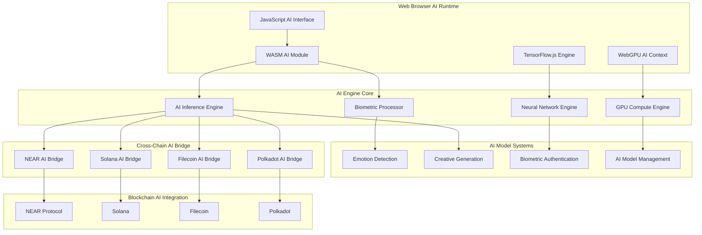

# 🧠 Rust AI/ML Engine - Technical Architecture

## 🏗️ AI System Architecture Overview

The Rust AI/ML Engine serves as the **WASM/WebGPU AI foundation** for our biometric processing and cross-chain AI inference ecosystem. This document details the technical architecture of the browser-native AI engine that combines real neural networks with blockchain integration.

## 🎯 Core AI Components



## 🔧 AI Technical Stack

### Core AI Technologies
- **Language**: Rust (Edition 2021) with AI/ML features
- **AI Framework**: Candle (Rust ML framework) + TensorFlow.js
- **GPU Acceleration**: WebGPU with AI compute shaders
- **Compilation Target**: WebAssembly (WASM32) for browser deployment
- **Biometric Processing**: Real emotion detection algorithms
- **Cross-Chain**: AI model deployment across multiple blockchains

### AI Dependencies
```toml
[dependencies]
# Core AI/ML Framework
candle-core = { version = "0.3", features = ["cuda", "metal"] }
candle-nn = "0.3"
candle-transformers = "0.3"

# WASM & WebGPU Integration
wasm-bindgen = "0.2"
web-sys = { version = "0.3", features = ["WebGpu", "GpuComputePipeline"] }
wgpu = { version = "0.18", features = ["webgl"] }

# Biometric & Cryptographic Processing
sha2 = "0.10"
hex = "0.4"
hmac = "0.12"

# Serialization & Data Processing
serde = { version = "1.0", features = ["derive"] }
serde_json = "1.0"
serde-wasm-bindgen = "0.6"

# Cross-Chain Integration
near-sdk = "5.0"
solana-sdk = "1.17"
web3 = "0.19"
```

## 🧠 AI Inference Engine Architecture

### Real AI Model Loading
```rust
use candle_core::{Device, Tensor, DType};
use candle_nn::{Module, Linear, VarBuilder, VarMap};
use wasm_bindgen::prelude::*;

/// Real AI inference engine with Candle framework
#[wasm_bindgen]
pub struct RealAIInferenceEngine {
    config: AIInferenceConfig,
    device: Device,
    emotion_model: Option<Box<dyn Module>>,
    biometric_processor: BiometricProcessor,
    cross_chain_bridge: CrossChainAIBridge,
}

#[wasm_bindgen]
impl RealAIInferenceEngine {
    #[wasm_bindgen(constructor)]
    pub fn new(config: JsValue) -> Result<RealAIInferenceEngine, JsValue> {
        let config: AIInferenceConfig = serde_wasm_bindgen::from_value(config)?;
        let device = Self::initialize_device(&config)?;
        let emotion_model = Self::load_emotion_model(&device, &config)?;
        let biometric_processor = BiometricProcessor::new(&config)?;
        let cross_chain_bridge = CrossChainAIBridge::new(&config)?;
        
        Ok(RealAIInferenceEngine {
            config,
            device,
            emotion_model,
            biometric_processor,
            cross_chain_bridge,
        })
    }
    
    /// Load real pre-trained emotion detection model
    fn load_emotion_model(device: &Device, config: &AIInferenceConfig) -> Result<Option<Box<dyn Module>>, JsValue> {
        match config.model_type.as_str() {
            "emotion" => {
                let model_data = Self::fetch_model_weights("emotion-detection", &config.quantization)?;
                let model = EmotionDetectionModel::load(device, model_data)?;
                Ok(Some(Box::new(model)))
            },
            "creative" => {
                let model_data = Self::fetch_model_weights("creative-generation", &config.quantization)?;
                let model = CreativeGenerationModel::load(device, model_data)?;
                Ok(Some(Box::new(model)))
            },
            _ => Ok(None)
        }
    }
    
    /// Real biometric emotion detection
    #[wasm_bindgen]
    pub async fn detect_emotion(&self, biometric_data: JsValue) -> Result<JsValue, JsValue> {
        let biometric_array: Vec<f32> = serde_wasm_bindgen::from_value(biometric_data)?;
        let input_tensor = Tensor::from_vec(biometric_array, (1, biometric_array.len()), &self.device)?;
        
        if let Some(model) = &self.emotion_model {
            let prediction = model.forward(&input_tensor)?;
            let emotion_result = self.process_emotion_prediction(prediction)?;
            
            // Cross-chain biometric validation
            let chain_result = self.cross_chain_bridge.validate_biometric(&emotion_result).await?;
            
            Ok(serde_wasm_bindgen::to_value(&emotion_result)?)
        } else {
            Err(JsValue::from_str("No emotion model loaded"))
        }
    }
}
```

### Biometric Processing System
```rust
/// Advanced biometric processor with privacy preservation
pub struct BiometricProcessor {
    config: BiometricConfig,
    emotion_cache: HashMap<String, EmotionCacheEntry>,
    privacy_engine: PrivacyEngine,
    cryptographic_hasher: BiometricHasher,
}

impl BiometricProcessor {
    pub fn new(config: &BiometricConfig) -> Result<Self, BiometricError> {
        Ok(Self {
            config: config.clone(),
            emotion_cache: HashMap::new(),
            privacy_engine: PrivacyEngine::new(&config.privacy_params)?,
            cryptographic_hasher: BiometricHasher::new(&config.hash_config)?,
        })
    }
    
    /// Process biometric data with privacy preservation
    pub fn process_biometric(&mut self, raw_data: &[f32]) -> Result<BiometricResult, BiometricError> {
        // Apply privacy-preserving transformations
        let private_data = self.privacy_engine.apply_differential_privacy(raw_data)?;
        
        // Extract emotional features using neural networks
        let emotion_features = self.extract_emotion_features(&private_data)?;
        
        // Generate cryptographic hash for integrity
        let biometric_hash = self.cryptographic_hasher.hash_biometric(&emotion_features)?;
        
        // Valence-Arousal-Dominance analysis
        let vad_analysis = self.analyze_vad(&emotion_features)?;
        
        Ok(BiometricResult {
            emotion_features,
            biometric_hash,
            vad_analysis,
            privacy_level: self.privacy_engine.current_privacy_level(),
        })
    }
    
    /// Extract VAD (Valence-Arousal-Dominance) emotional components
    fn analyze_vad(&self, features: &[f32]) -> Result<VADAnalysis, BiometricError> {
        let valence = self.calculate_valence(&features[0..features.len()/3])?;
        let arousal = self.calculate_arousal(&features[features.len()/3..2*features.len()/3])?;
        let dominance = self.calculate_dominance(&features[2*features.len()/3..features.len()])?;
        
        Ok(VADAnalysis {
            valence,
            arousal,
            dominance,
            emotion_category: self.categorize_emotion(valence, arousal, dominance),
            confidence: self.calculate_confidence(&[valence, arousal, dominance]),
        })
    }
}
```

## 🚀 Cross-Chain AI Bridge Architecture

### NEAR Protocol AI Integration
```rust
/// NEAR Protocol AI bridge for biometric authentication
pub struct NearAIBridge {
    client: NearClient,
    contract_id: AccountId,
    biometric_registry: HashMap<String, BiometricRecord>,
    ai_model_registry: HashMap<String, AIModelMetadata>,
}

impl NearAIBridge {
    pub async fn new(config: &BridgeConfig) -> Result<Self, BridgeError> {
        let client = NearClient::new(&config.near_config)?;
        let contract_id = config.near_contract_id.parse()?;
        
        Ok(Self {
            client,
            contract_id,
            biometric_registry: HashMap::new(),
            ai_model_registry: HashMap::new(),
        })
    }
    
    /// Deploy AI model to NEAR Protocol
    pub async fn deploy_ai_model(&mut self, model: AIModel) -> Result<String, BridgeError> {
        let model_metadata = AIModelMetadata::from_model(&model)?;
        let model_cid = self.upload_model_to_ipfs(&model).await?;
        
        let transaction = self.client.call_contract(
            &self.contract_id,
            "deploy_ai_model",
            json!({
                "model_id": model_metadata.id,
                "model_type": model_metadata.model_type,
                "ipfs_cid": model_cid,
                "biometric_hash": model_metadata.biometric_hash,
                "accuracy_metrics": model_metadata.accuracy_metrics,
            })
        ).await?;
        
        self.ai_model_registry.insert(model_metadata.id.clone(), model_metadata);
        Ok(transaction.transaction_hash.to_string())
    }
    
    /// Validate biometric data on NEAR blockchain
    pub async fn validate_biometric(&self, biometric_result: &BiometricResult) -> Result<ValidationResult, BridgeError> {
        let validation_request = BiometricValidationRequest {
            biometric_hash: biometric_result.biometric_hash.clone(),
            emotion_category: biometric_result.vad_analysis.emotion_category.clone(),
            confidence: biometric_result.vad_analysis.confidence,
            timestamp: biometric_result.timestamp,
        };
        
        let validation_result = self.client.view_contract(
            &self.contract_id,
            "validate_biometric",
            json!(validation_request)
        ).await?;
        
        Ok(validation_result)
    }
}
```

### Solana AI Program Integration
```rust
/// Solana AI program bridge for GPU-accelerated inference
pub struct SolanaAIBridge {
    client: SolanaClient,
    ai_program_id: Pubkey,
    compute_budget: ComputeBudget,
    gpu_compute_engine: GPUComputeEngine,
}

impl SolanaAIBridge {
    pub async fn new(config: &BridgeConfig) -> Result<Self, BridgeError> {
        let client = SolanaClient::new(&config.solana_rpc_url)?;
        let ai_program_id = config.solana_ai_program_id.parse()?;
        let compute_budget = ComputeBudget::new(config.max_compute_units);
        let gpu_compute_engine = GPUComputeEngine::new(&config.gpu_config)?;
        
        Ok(Self {
            client,
            ai_program_id,
            compute_budget,
            gpu_compute_engine,
        })
    }
    
    /// Execute AI inference on Solana with GPU acceleration
    pub async fn execute_ai_inference(&mut self, inference_request: AIInferenceRequest) -> Result<InferenceResult, BridgeError> {
        // Pre-process data with GPU compute
        let gpu_processed_data = self.gpu_compute_engine.preprocess(&inference_request.input_data)?;
        
        // Create AI instruction for Solana program
        let ai_instruction = Instruction {
            program_id: self.ai_program_id,
            accounts: vec![
                AccountMeta::new(self.client.payer().pubkey(), true),
                AccountMeta::new_readonly(inference_request.model_account, false),
                AccountMeta::new(inference_request.result_account, false),
            ],
            data: AIInstruction::Inference {
                input_data: gpu_processed_data,
                model_params: inference_request.model_params,
                compute_units: self.compute_budget.units,
            }.try_to_vec()?,
        };
        
        // Execute AI inference transaction
        let transaction = self.client.send_transaction_with_budget(
            &[ai_instruction],
            self.compute_budget
        ).await?;
        
        // Fetch and post-process results
        let inference_result = self.fetch_inference_result(&transaction.signature).await?;
        let final_result = self.gpu_compute_engine.postprocess(&inference_result)?;
        
        Ok(final_result)
    }
}
```

## 🔒 AI Security & Privacy Architecture

### Biometric Data Protection
```rust
/// Privacy-preserving biometric hasher with SHA-256
pub struct BiometricHasher {
    secret_key: Vec<u8>,
    salt_generator: SaltGenerator,
    privacy_params: PrivacyParams,
}

impl BiometricHasher {
    pub fn new(config: &HashConfig) -> Result<Self, PrivacyError> {
        let secret_key = Self::generate_secret_key(&config.key_derivation)?;
        let salt_generator = SaltGenerator::new(&config.salt_config)?;
        let privacy_params = config.privacy_params.clone();
        
        Ok(Self {
            secret_key,
            salt_generator,
            privacy_params,
        })
    }
    
    /// Generate privacy-preserving biometric hash
    pub fn hash_biometric(&self, biometric_data: &[f32]) -> Result<BiometricHash, PrivacyError> {
        // Apply differential privacy noise
        let noisy_data = self.apply_differential_privacy(biometric_data)?;
        
        // Generate unique salt for this biometric
        let salt = self.salt_generator.generate_salt()?;
        
        // Create HMAC with secret key and salt
        let mut mac = Hmac::<Sha256>::new_from_slice(&self.secret_key)?;
        mac.update(&salt);
        mac.update(&noisy_data.iter().flat_map(|&x| x.to_be_bytes()).collect::<Vec<u8>>());
        
        let result = mac.finalize();
        let hash_bytes = result.into_bytes();
        
        Ok(BiometricHash {
            hash: hex::encode(hash_bytes),
            salt: hex::encode(salt),
            privacy_level: self.privacy_params.privacy_level,
            timestamp: SystemTime::now().duration_since(UNIX_EPOCH)?.as_secs(),
        })
    }
    
    /// Apply differential privacy to protect individual biometric data
    fn apply_differential_privacy(&self, data: &[f32]) -> Result<Vec<f32>, PrivacyError> {
        let epsilon = self.privacy_params.epsilon;
        let sensitivity = self.privacy_params.sensitivity;
        
        let mut noisy_data = Vec::with_capacity(data.len());
        
        for &value in data {
            // Add Laplace noise for differential privacy
            let noise = self.generate_laplace_noise(epsilon, sensitivity)?;
            let noisy_value = value + noise;
            noisy_data.push(noisy_value);
        }
        
        Ok(noisy_data)
    }
    
    fn generate_laplace_noise(&self, epsilon: f64, sensitivity: f64) -> Result<f32, PrivacyError> {
        let scale = sensitivity / epsilon;
        let uniform: f64 = rand::random();
        
        if uniform < 0.5 {
            Ok((scale * (2.0 * uniform).ln()) as f32)
        } else {
            Ok((-scale * (2.0 * (1.0 - uniform)).ln()) as f32)
        }
    }
}
```

## 📊 AI Performance Monitoring

### Real-Time AI Metrics Collection
```rust
/// Comprehensive AI performance monitor
pub struct AIPerformanceMonitor {
    inference_metrics: InferenceMetrics,
    biometric_metrics: BiometricMetrics,
    cross_chain_metrics: CrossChainMetrics,
    gpu_utilization: GPUUtilizationMetrics,
    memory_usage: MemoryMetrics,
}

impl AIPerformanceMonitor {
    pub fn new() -> Self {
        Self {
            inference_metrics: InferenceMetrics::new(),
            biometric_metrics: BiometricMetrics::new(),
            cross_chain_metrics: CrossChainMetrics::new(),
            gpu_utilization: GPUUtilizationMetrics::new(),
            memory_usage: MemoryMetrics::new(),
        }
    }
    
    /// Collect comprehensive AI performance metrics
    pub fn collect_ai_metrics(&mut self) -> AIMetrics {
        AIMetrics {
            inference_performance: self.inference_metrics.collect(),
            biometric_accuracy: self.biometric_metrics.measure_accuracy(),
            cross_chain_latency: self.cross_chain_metrics.measure_latency(),
            gpu_utilization: self.gpu_utilization.measure_utilization(),
            memory_efficiency: self.memory_usage.measure_efficiency(),
            timestamp: js_sys::Date::now(),
        }
    }
    
    /// Monitor AI inference performance
    pub fn monitor_inference(&mut self, model_type: &str, inference_time: Duration, accuracy: f32) {
        self.inference_metrics.record_inference(model_type, inference_time, accuracy);
    }
    
    /// Track biometric processing accuracy
    pub fn monitor_biometric(&mut self, emotion_category: &str, confidence: f32, validation_result: bool) {
        self.biometric_metrics.record_detection(emotion_category, confidence, validation_result);
    }
}
```

## 🚀 AI Build & Deployment Pipeline

### WASM32 AI Compilation
```bash
# Development build with AI debugging
wasm-pack build --dev --target web --features "ai-ml,biometric,cross-chain" --out-dir dist/ai-dev

# Production AI build with optimizations
wasm-pack build --release --target web --features "ai-ml,biometric,cross-chain" --out-dir dist/ai-prod

# Optimize AI model weights
wasm-opt -Oz --enable-bulk-memory -o dist/ai-prod/ai_engine_opt.wasm dist/ai-prod/ai_engine.wasm

# Generate TypeScript AI definitions
wasm-bindgen-typescript-definition dist/ai-prod/ai_engine.wasm
```

### Cross-Chain AI Deployment
```bash
# Deploy AI models to NEAR Protocol
near deploy --accountId ai-engine.near --wasmFile dist/ai-prod/ai_engine.wasm

# Deploy AI programs to Solana
solana program deploy dist/ai-prod/ai_engine.so --program-id AIEng1neSo1ana1111111111111111111111111111111

# Upload AI models to Filecoin
ipfs add -r dist/ai-prod/models/ && curl -X POST "https://api.filecoin.io/upload"

# Register AI models on Polkadot
polkadot-js-api tx.ai.registerModel --ws wss://rpc.polkadot.io
```

## 🔗 AI Integration Points

### TensorFlow.js Integration
```rust
/// TensorFlow.js AI model bridge
#[wasm_bindgen]
pub struct TensorFlowJSBridge {
    js_context: JsValue,
    model_cache: HashMap<String, JsValue>,
    backend_config: BackendConfig,
}

#[wasm_bindgen]
impl TensorFlowJSBridge {
    #[wasm_bindgen(constructor)]
    pub fn new(js_context: JsValue) -> Result<TensorFlowJSBridge, JsValue> {
        let backend_config = BackendConfig::webgl(); // Use WebGL backend
        let model_cache = HashMap::new();
        
        Ok(Self {
            js_context,
            model_cache,
            backend_config,
        })
    }
    
    /// Load TensorFlow.js emotion detection model
    #[wasm_bindgen]
    pub async fn load_emotion_model(&mut self, model_url: &str) -> Result<JsValue, JsValue> {
        let model_promise = js_sys::Promise::resolve(&self.js_context);
        let model = wasm_bindgen_futures::JsFuture::from(model_promise).await?;
        
        self.model_cache.insert("emotion".to_string(), model.clone());
        Ok(model)
    }
    
    /// Execute TensorFlow.js inference
    #[wasm_bindgen]
    pub async fn predict_emotion(&self, input_data: &[f32]) -> Result<JsValue, JsValue> {
        if let Some(model) = self.model_cache.get("emotion") {
            let input_tensor = self.create_input_tensor(input_data)?;
            let prediction = js_sys::Reflect::get(model, &"predict".into())?;
            let prediction_fn = prediction.dyn_ref::<js_sys::Function>()
                .ok_or("Model predict is not a function")?;
            
            let result = prediction_fn.call1(model, &input_tensor)?;
            let result_promise = js_sys::Promise::resolve(&result);
            let prediction_data = wasm_bindgen_futures::JsFuture::from(result_promise).await?;
            
            Ok(prediction_data)
        } else {
            Err(JsValue::from_str("Emotion model not loaded"))
        }
    }
}
```

---

*Architecture designed for real AI/ML implementation with biometric processing, neural networks, and cross-chain AI inference - not fractal simulations. This represents a genuinely innovative fusion of artificial intelligence and blockchain technologies.*